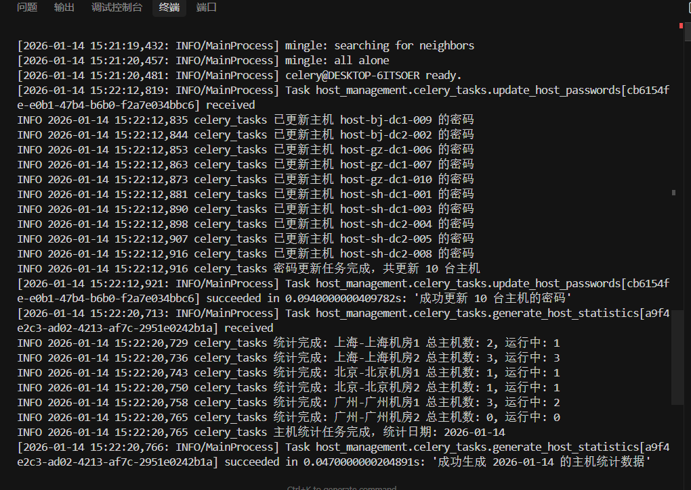
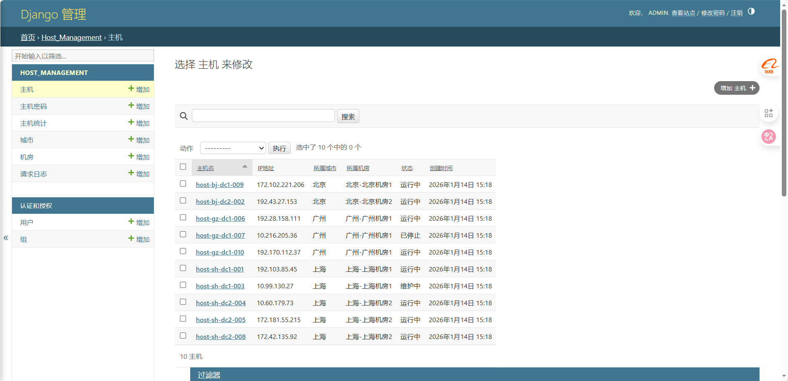
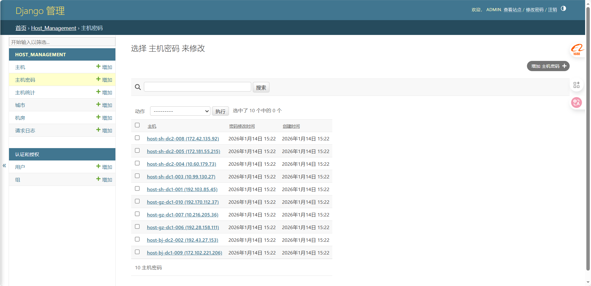

# 主机管理系统

基于Django和Celery的企业内部主机管理系统。

## 预览截图







## 功能特性

1. **主机管理**
   - 管理企业内部主机信息
   - 支持城市、机房、主机三级管理
   - 主机状态管理（运行中、已停止、维护中）

2. **API接口**
   - RESTful API设计
   - 提供城市、机房、主机的增删改查接口
   - 主机ping探测接口

3. **密码管理**
   - 自动维护每台主机的root密码
   - 每8小时自动随机修改密码
   - 密码加密存储

4. **统计分析**
   - 每天00:00自动统计主机数量
   - 按城市和机房维度统计
   - 统计数据持久化存储

5. **请求监控**
   - 中间件自动记录每个请求的耗时
   - 支持查询请求日志

## 技术栈

- Python 3.12+
- Django 6.0.1
- Django REST Framework 3.15.2
- Celery 5.4.0
- Redis 5.2.0
- cryptography 43.0.1

## 项目结构

```
backend/
├── backend/              # Django项目配置
│   ├── settings.py       # 项目设置
│   ├── urls.py          # URL路由
│   └── ...
├── host_management/      # 主机管理应用
│   ├── models.py        # 数据模型
│   ├── serializers.py   # 序列化器
│   ├── middleware.py    # 中间件
│   ├── celery_tasks.py  # Celery任务
│   └── utils.py         # 工具函数
├── api/                 # API应用
│   ├── views.py        # API视图
│   └── urls.py         # API路由
├── manage.py           # Django管理脚本
└── requirements.txt    # 依赖包列表
```

## 安装和运行

### 1. 安装依赖

```bash
cd backend
pip install -r requirements.txt
```

### 2. 配置数据库

```bash
python manage.py makemigrations
python manage.py migrate
```

### 3. 创建超级用户（可选）

```bash
python manage.py createsuperuser
```

### 4. 配置Redis（Celery需要）

确保Redis服务正在运行：

```bash
# Windows
# 下载并启动Redis服务

# Linux/Mac
redis-server
```

### 5. 启动Django开发服务器

```bash
python manage.py runserver
```

### 6. 启动Celery Worker

```bash
celery -A host_management worker -l info
```

### 7. 启动Celery Beat（定时任务）

```bash
celery -A host_management beat -l info
```

## API接口文档

### 城市管理

- `GET /api/cities/` - 获取城市列表
- `POST /api/cities/` - 创建城市
- `GET /api/cities/{id}/` - 获取城市详情
- `PUT /api/cities/{id}/` - 更新城市
- `DELETE /api/cities/{id}/` - 删除城市

### 机房管理

- `GET /api/data-centers/` - 获取机房列表（支持?city_id=过滤）
- `POST /api/data-centers/` - 创建机房
- `GET /api/data-centers/{id}/` - 获取机房详情
- `PUT /api/data-centers/{id}/` - 更新机房
- `DELETE /api/data-centers/{id}/` - 删除机房

### 主机管理

- `GET /api/hosts/` - 获取主机列表（支持?city_id=、?data_center_id=、?status=过滤）
- `POST /api/hosts/` - 创建主机
- `GET /api/hosts/{id}/` - 获取主机详情
- `PUT /api/hosts/{id}/` - 更新主机
- `DELETE /api/hosts/{id}/` - 删除主机
- `GET /api/hosts/{id}/ping/` - 探测主机是否ping可达

### 统计查询

- `GET /api/statistics/` - 获取统计数据（支持?city_id=、?data_center_id=、?statistics_date=过滤）

## 环境变量配置

生产环境建议配置以下环境变量：

- `ENCRYPTION_KEY`: 密码加密密钥（Fernet密钥）
- `CELERY_BROKER_URL`: Celery消息代理URL
- `CELERY_RESULT_BACKEND`: Celery结果后端URL

## 注意事项

1. 密码加密密钥：生产环境必须设置`ENCRYPTION_KEY`环境变量，否则每次重启会生成新密钥导致无法解密已有密码。

2. Celery定时任务：密码更新任务每8小时执行一次，统计任务每天00:00执行。

3. Ping功能：ping功能依赖系统ping命令，Windows和Linux命令格式不同，已自动适配。

4. 请求日志：所有API请求的耗时都会自动记录到`RequestLog`模型中，可通过Django Admin查看。

## 开发说明

本项目采用模块化设计：

- `host_management`: 核心业务逻辑模块
- `api`: API接口模块
- 中间件、任务、工具函数独立模块化

便于维护和扩展。


